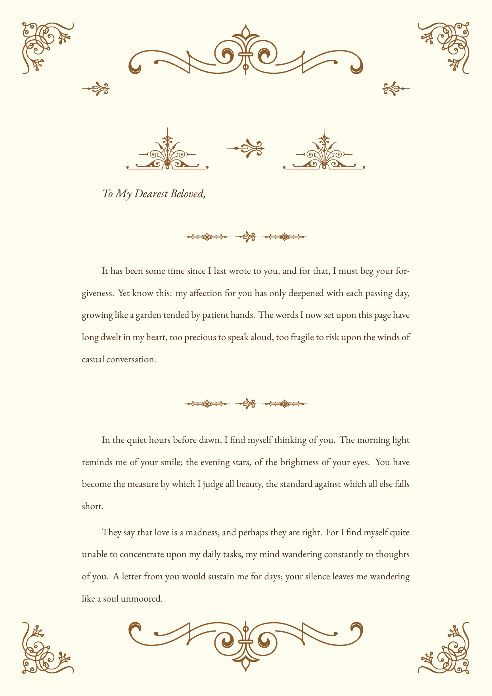

# VintageLetter

[](https://www.latex-project.org/lppl/)
[](https://tug.org/xetex/)

> *"A letter is a soul's whisper upon paper, dressed in the elegance of ages past."*

A beautifully crafted **LaTeX document class** for creating vintage-styled letters with Victorian-era ornaments, inspired by the elegance of 19th-century correspondence.



## Features

- **Victorian Ornaments**: 196 decorative elements from `pgfornament` by Alain Matthes
- **Vintage Typography**: EB Garamond typeface with Old-Style numerals
- **Parchment Aesthetic**: Warm cream background with ink-brown text
- **Multi-language Support**: Full CJK (Japanese/Chinese) compatibility via `xeCJK`
- **Elegant Decorations**: Corner flourishes, floral headers, ornamental dividers
- **Easy to Use**: Simple commands for addressee, dedication, and signature

## Requirements

- **Compiler**: XeLaTeX (required for font handling)
- **Required Packages**: 
  - `fontspec`, `xeCJK`
  - `tikz`, `pgfornament`
  - `geometry`, `fancyhdr`, `setspace`
  - `xcolor`, `eso-pic`, `hyperref`

### System Fonts

The template uses these system fonts (adjustable in the class file):
- **EB Garamond** — Body text (install via TeX Live: `tlmgr install ebgaramond`)
- **Yu Gothic** — CJK characters (Windows/macOS system font)

## Quick Start

1. **Copy** `vintageletter.cls` to your project directory
2. **Create** your letter:

```latex
\documentclass{vintageletter}

\begin{document}

\addressee{My Dearest,}

This is the body of your letter. The parchment background and
ornamental decorations are automatically applied.

\ornrule

Use \verb|\ornrule| to add decorative dividers between sections.

\begin{dedication}
With all my love,
\end{dedication}

\signature{Your Name}

\end{document}
```

3. **Compile**:
```bash
xelatex your-letter.tex
```

## Available Commands

| Command | Description |
|---------|-------------|
| `\addressee{name}` | Addressee line with ornamental rule below |
| `\ornrule` | Decorative divider with central flourish |
| `\cornerdeco` | Four-corner ornaments (auto-applied) |
| `\floralheader` | Top floral decoration (auto-applied) |
| `\signature{name}` | Right-aligned signature with ornaments |
| `\begin{dedication}...\end{dedication}` | Centered dedication block |

## Color Palette

| Color | RGB | Usage |
|-------|-----|-------|
| `inkbrown` | #4A2C18 | Main text |
| `orncolor` | #8B5A2B | Ornaments |
| `pagecream` | #FFFCF0 | Background |
| `ruledgold` | #B48C3C | Dividers |
| `accentred` | #8B2323 | Dedication text |

## Repository Structure

```
vintageletter/
├── vintageletter.cls      # Main class file
├── README.md              # This file
├── LICENSE                # LPPL 1.3c
└──examples/
     ├── example-english.tex        # English letter example source file
     └── example-english.pdf        # English letter example

```

## Examples

See `examples/example.tex` for a complete sample letter.

## Customization

### Changing Fonts

Edit `vintageletter.cls`:

```latex
% For Chinese, use Source Han Serif:
\setCJKmainfont{Source Han Serif SC}[
  BoldFont = Source Han Serif SC Bold
]

% Or for a different Western font:
\setmainfont{Cormorant Garamond}[
  Ligatures=TeX,
  Numbers=OldStyle
]
```

### Adjusting Colors

```latex
\definecolor{inkbrown}{RGB}{60,40,20}     % Darker text
\definecolor{orncolor}{RGB}{160,100,50}   % Brighter ornaments
```

### Ornament Selection

The template uses these `pgfornament` designs:
- **#11, #14**: Small floral elements (headers)
- **#46**: Horizontal border lines
- **#55**: Signature flourish
- **#61**: Corner decorations
- **#69**: Large floral header
- **#71**: Signature underline
- **#84**: Divider side elements

Browse all 196 ornaments at the [pgfornament documentation](https://ctan.org/pkg/pgfornament).

## License

This project is licensed under the **LaTeX Project Public License (LPPL) 1.3c**.

The `pgfornament` ornaments are by Alain Matthes and are also under LPPL.

## Acknowledgments

- **Alain Matthes** — Creator of `pgfornament`
- **Georg Duffner** — Designer of EB Garamond
- **LaTeX Community** — For the endless inspiration

## Contributing

Contributions are welcome! Whether it's:
- Bug fixes
- New language examples
- Additional ornament combinations
- Documentation improvements

Please open an issue or pull request.

---

*"In an age of instant messages, take time to craft something eternal."*
